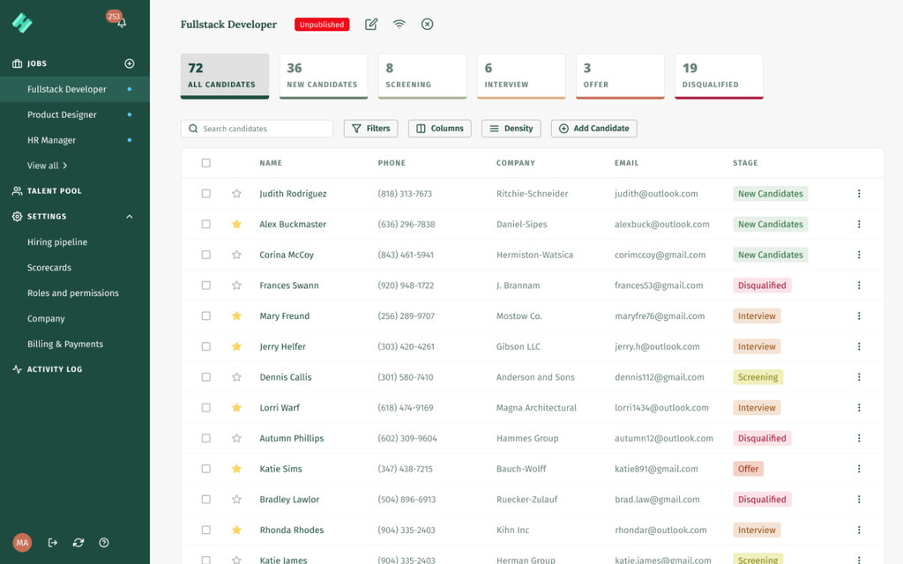

<h1 align="center"><a href="https://www.hirecinch.com/">Hirecinch</a></h1>
<h3>The most intuitive & affordable Applicant Tracking System!</h3>

All in one hiring software that enables you to attract quality applicants & evaluate them collaboratively so you can find the right fit for your team.

<a href="https://auth.hirecinch.com/signup">Try for free!</a>

<h3>Attract and reach out to applicants who matter!</h3>

Stop looking for applicants in a hundred different places. With Hirecinch, you can find and attract the right people from a single place!

<a href="https://www.hirecinch.com/source">View features!</a>

<h3>The easiest way to track & manage applicants!</h3>

Tracking and managing your jobs and applicants on your fingertips, to get a hassle-free and smooth hiring experience.

<a href="https://www.hirecinch.com/track">View features!</a>

<h3>Don’t settle on less, evaluate to find the perfect match!</h3>

Whether you are a start-up or a large corporation, evaluation is the most important part of the hiring process. Our applicant tracking system’s collaborative evaluation process makes sure you get the right people on the right seats.

<a href="https://www.hirecinch.com/evaluate">View features!</a>

<h2>
  FAQs
</h2>

<h4>Why do I need Hirecinch?</h4>

Hirecinch is a complete applicant tracking system that covers every aspect of your hiring process. From finding and attracting the right candidates to communicating with them, from evaluating them with your team to finally hiring them, Hirecinch assists you at each step of the pipeline.

<h4>How can I sign-up for Hirecinch?</h4>

To sign-up for Hirecinch, go to <a href="https://auth.hirecinch.com/signup">this link</a>. Fill out your Name, Company name, Work Email and Password to create an account and start hiring!

<h4>Is Hirecinch free or paid?</h4>

Hirecinch is a paid service. To view the payment plans we offer, you can go to <a href="https://auth.hirecinch.com/pricing">this link</a>. However, we offer a 14-day free trial for everyone. You can sign-up and use Hirecinch without a credit card for 14 days without any costs incurred.

<h3>SIGNUP NOW AND START HIRING!</h3>
<a href="https://auth.hirecinch.com/signup">Get Started</a>
   

Powered by <a href="https://www.carteblanche.tech">Carte Blanche Innovation Integrated</a>

<!-- Please don't remove this: Grab your social icons from https://github.com/carlsednaoui/gitsocial -->

<!-- display the social media buttons in your README -->

[![alt text][1.1]][1]
[![alt text][2.1]][2]
[![alt text][3.1]][3]
[![alt text][4.1]][4]
[![alt text][5.1]][5]
[![alt text][6.1]][6]

<!-- links to social media icons -->
<!-- no need to change these -->

<!-- icons with padding -->

[1.1]: http://i.imgur.com/tXSoThF.png (twitter icon with padding)
[2.1]: http://i.imgur.com/P3YfQoD.png (facebook icon with padding)
[3.1]: http://i.imgur.com/yCsTjba.png (google plus icon with padding)
[4.1]: http://i.imgur.com/YckIOms.png (tumblr icon with padding)
[5.1]: http://i.imgur.com/1AGmwO3.png (dribbble icon with padding)
[6.1]: http://i.imgur.com/0o48UoR.png (github icon with padding)

<!-- icons without padding -->

[1.2]: http://i.imgur.com/wWzX9uB.png (twitter icon without padding)
[2.2]: http://i.imgur.com/fep1WsG.png (facebook icon without padding)
[3.2]: http://i.imgur.com/VlgBKQ9.png (google plus icon without padding)
[4.2]: http://i.imgur.com/jDRp47c.png (tumblr icon without padding)
[5.2]: http://i.imgur.com/Vvy3Kru.png (dribbble icon without padding)
[6.2]: http://i.imgur.com/9I6NRUm.png (github icon without padding)

<!-- links to your social media accounts -->
<!-- update these accordingly -->

[1]: http://www.twitter.com/carlsednaoui
[2]: http://www.facebook.com/sednaoui
[3]: https://plus.google.com/+CarlSednaoui
[4]: http://carlsed.tumblr.com
[5]: http://dribbble.com/carlsednaoui
[6]: http://www.github.com/carlsednaoui

<!-- Please don't remove this: Grab your social icons from https://github.com/carlsednaoui/gitsocial -->

